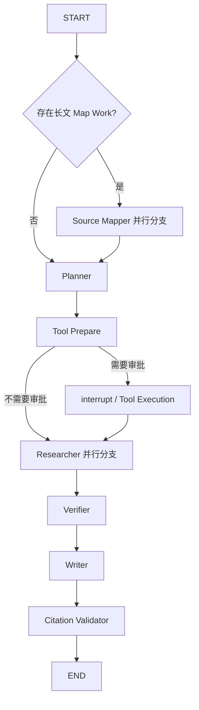
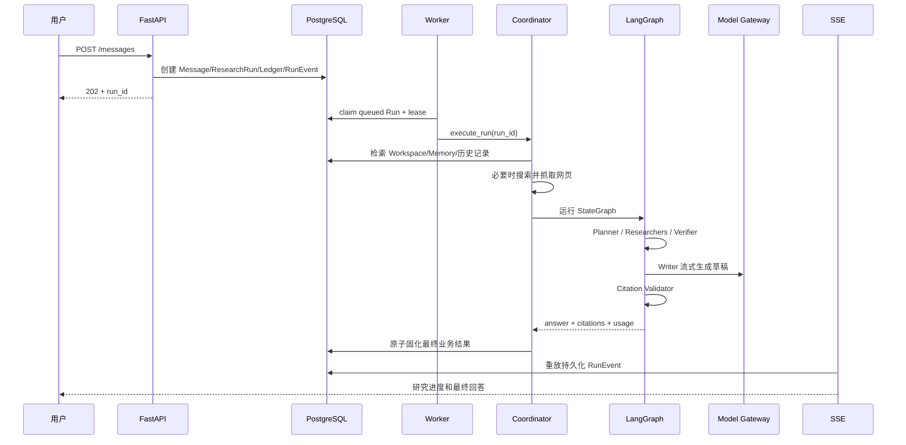

# Agent Runtime 当前实现与架构导读

## 1. 文档目的

本文用于帮助开发者理解当前后端 Agent Runtime 的真实实现，重点回答：

- 一次研究请求如何从 FastAPI 进入队列并由 Worker 执行
- LangGraph 在系统中负责什么，不负责什么
- Planner、Researcher、Verifier、Writer 分别做什么
- 当前架构是否属于 Plan-and-Solve
- 当前研究过程是否属于 ReAct
- 建议按什么顺序阅读代码

本文描述的是当前代码，而不是未来可能演进到的完整自主研究 Agent。

## 2. 核心结论

当前实现不是严格意义上的“Plan-and-Solve + ReAct”。

更准确的描述是：

> 一个基于 LangGraph 的、可持久化恢复的有界研究工作流，采用 Orchestrator-Worker 和受限 Map-Reduce 并行，结合 Evidence-first RAG、Writer 模型生成与 Citation 校验

它具有 Plan-and-Solve 的外形，但 Planner 当前是确定性规则函数；它也存在工具调用能力，但没有“模型决策 → 调用工具 → 观察结果 → 再次决策”的循环，因此当前研究过程不是 ReAct。

## 3. 系统分层

### 3.1 API 与业务事实层

主要入口：`apps/api/src/deep_researcher/app.py`

用户发送消息时，API 在同一个数据库事务中创建：

- 用户 `Message`
- 空的 assistant `Message`
- `ResearchRun(status="queued")`
- `ResearchLedger`
- 第一个 `RunEvent(type="run_queued")`

这一步只负责创建业务事实，不在 API 请求线程中执行 LangGraph。

### 3.2 持久队列与 Worker 层

主要文件：

- `apps/api/src/deep_researcher/run_queue.py`
- `apps/api/src/deep_researcher/worker.py`
- `apps/api/src/deep_researcher/worker_main.py`

`RunQueue.claim()` 使用数据库行锁和 `FOR UPDATE SKIP LOCKED` 领取任务，并写入：

- `lease_owner`
- `lease_expires_at`
- `heartbeat_at`
- `attempt`

Worker 领取 Run 后启动 heartbeat，并调用 `ResearchCoordinator.execute_run()`。如果 Worker 崩溃，租约过期后其他 Worker 可以重新领取运行中的 Run。

### 3.3 领域编排层

主要文件：`apps/api/src/deep_researcher/coordinator.py`

`ResearchCoordinator` 是业务编排中心，负责：

- 读取触发消息和恢复命令
- 解析当前 Workspace 的 Skill 和工具权限
- 检索 Workspace 文档、历史研究记录、会话线索和长期 Memory
- 必要时执行 Brave Search 和网页正文获取
- 将外部来源固化为 `SourceSnapshot` 和 `SourceChunk`
- 构建不可变的 `FrozenResearchContext`
- 调用 LangGraph Runtime
- 将 Graph 更新投影为 `ResearchTask` 和 `RunEvent`
- 执行预算预留、Usage 结算、取消检查和 Sandbox Todo 等领域逻辑
- 最终原子写入 assistant Message、Citation、Research Record 和完成事件

Coordinator 把“业务事实和副作用”留在领域层，LangGraph 主要负责节点顺序、并行、条件分支、暂停和恢复。

### 3.4 LangGraph 执行层

主要文件：`apps/api/src/deep_researcher/graph.py`

当前 Graph 是一个 Flat `StateGraph`，没有自由递归 Supervisor：



`Send` 只用于两个受限场景：

- 将长文 Source Map Work 并行分发给 `source_mapper`
- 将有限的 Research Brief 并行分发给 `researcher`

Graph 通过 `thread_id=run:{run_id}` 使用 checkpoint。PostgreSQL 环境使用官方 PostgreSQL checkpointer，本地测试可以使用内存 checkpointer。

## 4. 一次研究请求的完整路径



具体步骤如下。

### 4.1 API 创建 Run

`create_app.send_message()` 校验 Workspace、Conversation 和 Attachment 权限，并使用 `Idempotency-Key` 防止重复创建 Run。

事务提交后，Run 已经可靠存在于数据库。API 不需要把它提交给进程内线程池，独立 Worker 会从数据库领取。

### 4.2 Worker 领取 Run

`RunQueue.claim()` 可以领取：

- `status="queued"` 的 Run
- `status="running"` 但租约已经过期的 Run

Worker 执行期间周期性更新 heartbeat。执行完成、失败或进入等待审批状态后释放当前租约。

### 4.3 Coordinator 准备研究上下文

Coordinator 首先构造单次模型调用的 Context Budget，然后从当前用户可见范围内检索：

- 当前 Workspace 文档片段
- 历史 Research Record
- 当前 Conversation 的相关上下文
- 长期 Memory
- 用户对旧回答的纠正
- 已启用 Skill 和有效工具权限

如果当前运行要求外部网页研究，或者本地没有任何可用证据、Memory、会话线索和纠正，Coordinator 会执行网页搜索：

1. 使用原问题调用 Brave Search，最多获取 5 个候选
2. 尝试读取前 3 个网页正文
3. 将结果持久化为 `SourceSnapshot`
4. 将可读正文切分并持久化为 `SourceChunk`
5. 记录正文获取失败形成的 Evidence Gap
6. 构造后续 Graph 可使用的冻结来源

搜索和网页读取发生在 Coordinator 中，而不是由 Researcher 在循环中自主决定。

### 4.4 可选的长文 Map-Reduce

如果问题需要处理完整长页面，Coordinator 会创建 `SourceMapWork`。Graph 使用 `Send` 并行执行多个 Source Mapper：

- 读取限定 Chunk
- 通过 `ModelGateway.acomplete_map_work()` 提取 Digest、候选主张和原文 locator
- 通过 `SourceMapLedger` 幂等提交结果
- 最后在 Coordinator 中执行 reduce 和证据候选校验

这是受限 Map-Reduce，不是递归 Researcher。

### 4.5 Planner 生成有限任务

`agents/planner.py` 中的 `plan()` 当前是确定性规则函数，而不是 LLM Planner。

它固定创建：

- researcher：检索空间资料与网页证据
- verifier：核对证据与引用边界
- writer：形成初步结论

同时固定产生两个 Research Brief：

- 检索问题的直接证据
- 检索问题的差异、限制与反例

当问题包含“计算”“绘图”“数据分析”“算一下”等关键词时，额外创建 Python Sandbox 任务。

Planner 的输出会由 Coordinator 固化为 `ResearchTask`，并在模型调用前完成预算预留。

### 4.6 Tool Approval 与恢复

`tool_prepare` 会检查是否存在明确的高风险工具意图。

如果需要工具审批：

1. 创建幂等的 `ToolCall` 和 `ToolApproval`
2. 将 Run 设置为 `waiting_approval`
3. 使用 LangGraph `interrupt()` 暂停
4. 用户批准或拒绝后，Worker 以相同 `thread_id` 恢复 Graph
5. 校验用户、参数哈希、审批状态、有效期和 Workspace Grant
6. 在 `ToolRun` 幂等边界内执行一次工具

该流程解决的是副作用安全和恢复问题，并不构成 ReAct 工具循环。

### 4.7 Researcher 并行分支

`agents/researcher.py` 当前没有调用 LLM，也不会自主调用搜索工具。

每个分支接收：

- 一个 `ResearchBrief`
- Coordinator 已经冻结的 sources

然后返回：

- ordinal
- completed/failed 状态
- 固定格式 summary
- source IDs
- 可选 failure impact

所以当前 Researcher 更接近“受限并行工作分支”，还不是自主研究 Agent。实际检索主要由 Coordinator 完成，证据综合主要由 Writer 完成。

### 4.8 Verifier

`agents/verifier.py` 当前也是确定性逻辑：

- 没有 findings：`insufficient`
- 任一 Researcher 失败：`insufficient`
- 所有分支完成：`supported`

它检查的是研究分支完整性，还不是基于模型的语义 Claim/Evidence 核验器。长文路径另外通过 Research Ledger 和 Evidence Candidate 承担更细的证据校验。

### 4.9 Writer 与模型调用

`agents/writer.py` 将以下内容组装为 `AnswerContext`：

- 用户问题
- 可引用 Evidence
- 用户纠正
- 长期 Memory
- 历史会话线索
- Source Manifest
- 邻近原文窗口
- 已启用 Skill
- Cancellation Token

`LiteLLMModelGateway.astream_answer()` 负责实际模型调用。Prompt 明确要求：

- 只能将冻结证据和会话纠正作为已知事实
- 使用证据时必须紧跟对应引用编号
- 历史会话线索和 Source Manifest 不能当作事实证据
- 没有证据时必须声明证据不足
- 不输出思维链、工具过程或不存在的引用

当前主要的 LLM 使用点是 Writer 和可选 Source Mapper。Planner、Researcher、Verifier 与 Citation Validator 都是确定性的。

### 4.10 Citation Validator 与最终固化

Writer 只产生内部草稿。`citation_validator` 会：

- 解析回答中的引用编号
- 检查引用编号是否映射到当前 Run 的可引用来源
- 拒绝未知引用
- 生成安全回答和 Citation Draft

Graph 完成后，Coordinator 再次检查取消状态和租约所有者，并在事务中固化：

- assistant Message 内容
- Citation
- Research Record
- Model Usage
- Research Ledger 覆盖情况与停止原因
- 最终 `RunEvent`

SSE 读取的是持久化 `RunEvent`，而不是直接把 LangGraph 内部 stream 当作产品事件。

## 5. 为什么它不是严格的 Plan-and-Solve

经典 Plan-and-Solve 一般意味着：

1. Planner 根据具体问题动态拆解计划
2. Solver 按计划执行各步骤
3. 最后汇总或校验结果

当前实现满足第 2、3 步的结构，但 Planner 不是模型动态规划，而是固定规则模板。因此可以说它具有 Plan-and-Solve 的分阶段思想，但更准确的分类是：

> 固定模板的 Plan-and-Execute / Orchestrator-Worker 工作流

如果未来 Planner 改成结构化模型输出，根据问题动态生成有限 Research Goal、Search Query、预算和依赖关系，它才会更接近严格意义上的 Plan-and-Solve。

## 6. 为什么当前研究不是 ReAct

典型 ReAct 循环为：

```text
模型判断下一步
→ 选择并调用工具
→ 获得 Observation
→ 将 Observation 交回模型
→ 模型继续判断下一步
→ 达到停止条件后结束
```

当前实现不满足这一点：

- Graph 没有 `LLM → Tool → LLM` 回边
- Researcher 不调用模型
- Researcher 不根据已有 Observation 生成下一次搜索查询
- 网页搜索由 Coordinator 在进入 Graph 前集中执行
- 工具审批路径只执行一次明确副作用
- Writer 消费冻结上下文并生成答案，不会继续派发研究工具

因此，即使代码中存在 LangGraph、工具、Researcher 和条件边，也不能据此称为 ReAct。

## 7. 当前架构的准确分类

可以使用以下四个关键词理解当前实现。

### Durable Workflow

PostgreSQL 队列、Worker lease、heartbeat、checkpoint、幂等事件和恢复共同保证长任务不会依赖 API 进程生命周期。

### Bounded DAG

Graph 深度和角色固定，Researcher fan-out 有明确上限，不允许自由递归和动态生成无限子 Agent。

### Evidence-first RAG

来源先被检索、抓取、持久化并冻结，Writer 只能消费当前 Run 可见的证据，Citation 最终还需要领域层校验和持久化。

### Orchestrator-Worker

Coordinator 管理业务编排和副作用；LangGraph 管理执行顺序；Mapper 和 Researcher 负责受限并行工作；Writer 负责最终语言生成。

## 8. 两套状态必须区分

### 8.1 业务状态

业务数据库是唯一用户可见事实源，主要包括：

- `ResearchRun`
- `ResearchTask`
- `RunEvent`
- `Message`
- `Citation`
- `ResearchLedger`
- `Memory`
- `Skill`
- `ToolCall` / `ToolApproval` / `ToolRun`
- `SourceSnapshot` / `SourceChunk`

这些状态负责 ACL、审计、SSE 重放、引用、取消、审批和最终结果。

### 8.2 LangGraph Runtime 状态

LangGraph state 和 checkpoint 负责：

- 节点执行顺序
- 条件路由
- fan-out/fan-in
- interrupt/resume
- 内部执行恢复

checkpoint 使用 `run:{run_id}` 作为 `thread_id`，但不能取代业务表，也不能直接决定 Memory、Citation、Run 最终状态或 SSE 内容。

## 9. 建议阅读顺序

### 第一阶段：理解主执行骨架

1. `apps/api/src/deep_researcher/graph.py`
2. `apps/api/src/deep_researcher/agents/planner.py`
3. `apps/api/src/deep_researcher/agents/researcher.py`
4. `apps/api/src/deep_researcher/agents/verifier.py`
5. `apps/api/src/deep_researcher/agents/writer.py`

先画出节点和边，并确认每个角色到底有没有调用模型或工具。

### 第二阶段：理解 Graph 前后的业务编排

1. `apps/api/src/deep_researcher/coordinator.py::execute_run`
2. `ResearchCoordinator::_handle_graph_update`
3. `ResearchCoordinator::_search_web`
4. `ResearchCoordinator::_finalize_ledger`

重点理解为什么检索、预算、事件、取消和最终事务不直接放进 Graph 节点。

### 第三阶段：理解可靠执行

1. `apps/api/src/deep_researcher/app.py::send_message`
2. `apps/api/src/deep_researcher/run_queue.py`
3. `apps/api/src/deep_researcher/worker.py`
4. `apps/api/src/deep_researcher/event_log.py`
5. `apps/api/src/deep_researcher/run_event_projector.py`

重点跟踪 `queued → running → waiting_approval/completed/partial/failed/cancelled` 的状态变化。

### 第四阶段：理解模型、证据与外部能力

1. `apps/api/src/deep_researcher/model_gateway.py`
2. `apps/api/src/deep_researcher/retrieval.py`
3. `apps/api/src/deep_researcher/web_search.py`
4. `apps/api/src/deep_researcher/web_page.py`
5. `apps/api/src/deep_researcher/source_map.py`
6. `apps/api/src/deep_researcher/citation_validator.py`
7. `apps/api/src/deep_researcher/tool_execution.py`

重点区分搜索 snippet、完整网页快照、可引用 Evidence Span、Memory 和会话线索的不同可信边界。

## 10. 一句话记忆

> 当前 Agent Runtime 是一个可恢复、受限、有证据边界的研究工作流：Coordinator 先准备并冻结研究材料，LangGraph 执行固定 DAG，有限 Researcher 并行登记结果，Writer 使用模型生成草稿，Citation Validator 和领域事务负责最终可信输出；它具有 Plan-and-Solve 的分阶段思想，但当前既不是动态 Plan-and-Solve，也不是 ReAct

## 11. 相关设计文档

- `docs/adr/0001-domain-state-and-langgraph-runtime.md`
- `docs/adr/0004-agent-runtime-runs-in-a-dedicated-worker.md`
- `docs/adr/0005-postgresql-backed-run-queue.md`
- `docs/adr/0006-official-postgres-checkpointer.md`
- `docs/design/2026-08-06-technical-design.md`
- `docs/research/2026-08-09-recoverable-research-loop-and-evidence-ledger.md`
- `docs/research/2026-08-09-perplexity-and-open-source-deep-research.md`
